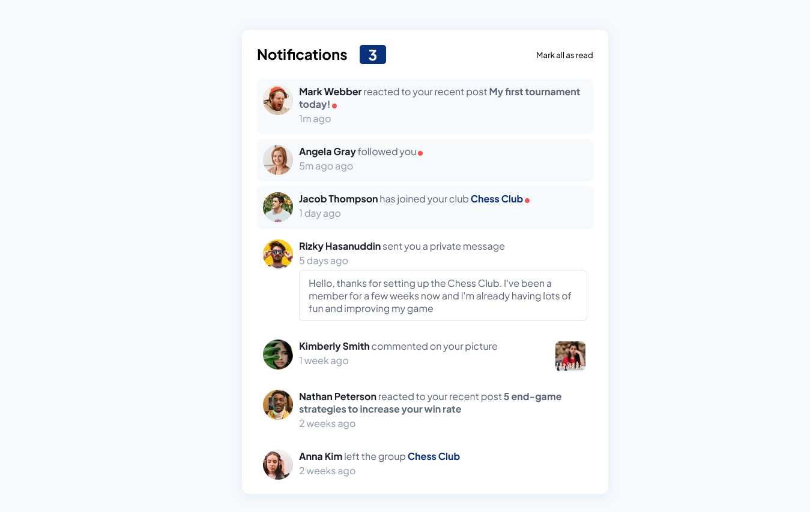

# Frontend Mentor - Notifications page solution

This is a solution to the [Notifications page challenge on Frontend Mentor](https://www.frontendmentor.io/challenges/notifications-page-DqK5QAmKbC).

## Overview

### The challenge

Users should be able to:

- Distinguish between "unread" and "read" notifications
- Select "Mark all as read" to toggle the visual state of the unread notifications and set the number of unread messages to zero
- View the optimal layout for the interface depending on their device's screen size
- See hover and focus states for all interactive elements on the page

### Screenshot

### Links

- Solution URL: [Github](https://github.com/ThatGuyChike/notifications-page)
- Live Site URL: [Vercel](https://notifications-page-d9uu00a7d-thatguychike.vercel.app)

## My process

### Built with

- Semantic HTML5 markup
- CSS custom properties
- Flexbox
- CSS Grid
- [React](https://reactjs.org/) - JS library

**Note: These are just examples. Delete this note and replace the list above with your own choices**

### What I learned

Intuitively knew when to use context to maintain consistent state. Would usually have devised a local state solution.

### Continued development

Need to use more relative units for sizing in future projects.

### Useful resources

- [Flexbox Guide](https://css-tricks.com/snippets/css/a-guide-to-flexbox/) - Used as guide in making use of CSS Flexbox.
- [Importing Custom Fonts CSS](https://www.digitalocean.com/community/tutorials/how-to-load-and-use-custom-fonts-with-css) - Used to figure out font imports on CSS.

## Author

- Frontend Mentor - [@ThatGuyChike](https://www.frontendmentor.io/profile/ThatGuyChike)
- Twitter - [@ThatGuyChike](https://www.twitter.com/ThatGuyChike)
